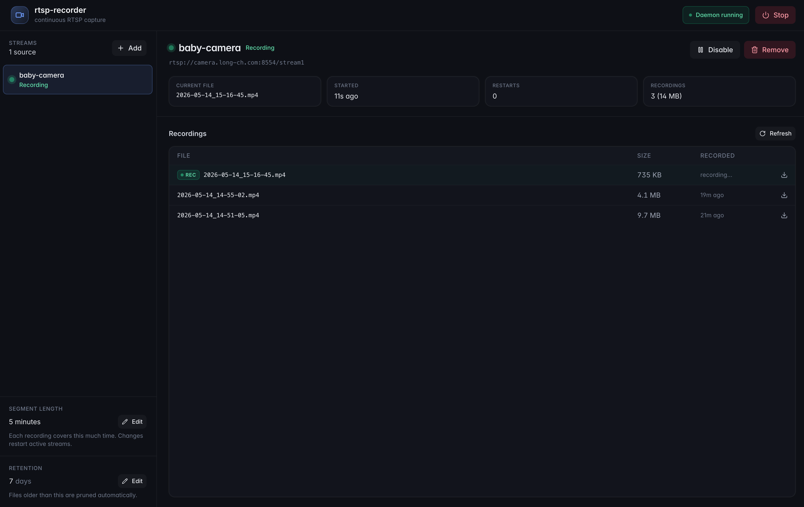

# rtsp-recorder

A small Python daemon that records one or more RTSP streams into rotating
1-minute MP4 files, with a polished web UI for managing it.



## Features

- Subscribe to any number of RTSP streams
- Each stream is split into 1-minute files named with a human-readable timestamp (`YYYY-MM-DD_HH-MM-SS.mp4`)
- Each stream gets its own folder under the data directory
- Automatic pruning of files older than a configurable retention window
- Web UI to start/stop the daemon, add/remove streams, browse and download recordings, and configure retention
- Designed to run as a long-lived service; ships with a Dockerfile + compose file
- Uses `ffmpeg`'s `segment` muxer for capture — robust, atomic file finalization, no transcoding

## Quick start (Docker)

```sh
docker compose up --build -d
```

Open <http://localhost:8765>. Recordings land in `./data/recordings/<stream>/`
on the host; the config (streams + retention) lives in `./data/config.json`.

## Local development

Backend (FastAPI + recorder loop):

```sh
uv sync
uv run rtsp-recorder
```

The backend listens on `http://localhost:8765`. By default it stores data in
`./data` — override with `RTSP_RECORDER_DATA_DIR=/path uv run rtsp-recorder`.
Port 8000 is intentionally avoided because several common dev tools (Django,
Cursor, etc.) squat on it; override with `RTSP_RECORDER_PORT=...` if 8765 is
also taken.

Frontend (Vite, with hot reload and `/api/*` proxied to the backend):

```sh
cd frontend
npm install
npm run dev    # opens http://localhost:5173
```

To produce a production bundle and serve it from the backend:

```sh
cd frontend
npm run build  # builds and copies dist/ into src/rtsp_recorder/static/
```

After that, the backend serves the UI at `/`.

## Configuration

All configuration is stored in `config.json` inside the data directory and is
edited via the web UI or the REST API. There are no required env vars.

| Env var                    | Default        | Purpose                       |
|----------------------------|----------------|-------------------------------|
| `RTSP_RECORDER_DATA_DIR`   | `./data`       | Where config + recordings go  |
| `RTSP_RECORDER_HOST`       | `0.0.0.0`      | HTTP bind address             |
| `RTSP_RECORDER_PORT`       | `8765`         | HTTP port                     |
| `RTSP_RECORDER_LOG_LEVEL`  | `INFO`         | Python log level              |

## REST API

```
GET    /api/status                       Service + per-stream live status
POST   /api/start                        Start the recorder daemon
POST   /api/stop                         Stop the recorder daemon

GET    /api/streams                      List configured streams
POST   /api/streams                      Add a stream { name, url, enabled }
PATCH  /api/streams/{name}               Update url and/or enabled flag
DELETE /api/streams/{name}               Remove a stream (files are kept)

GET    /api/streams/{name}/files         List recordings for a stream
GET    /api/streams/{name}/files/{file}  Download a recording

GET    /api/config                       Full persisted config
PUT    /api/config/retention             Update retention { retention_days }
```

OpenAPI docs are available at `/docs` while the service is running.

## Layout

```
src/rtsp_recorder/    Python package
  main.py             FastAPI app + REST API
  manager.py          Coordinates per-stream recorders + prune loop
  recorder.py         One-stream ffmpeg subprocess wrapper
  config.py           Atomic JSON config store
  models.py           Pydantic models
  static/             Built frontend (generated)
frontend/             React + Vite + Tailwind UI
data/                 Persisted state at runtime (config + recordings)
```
